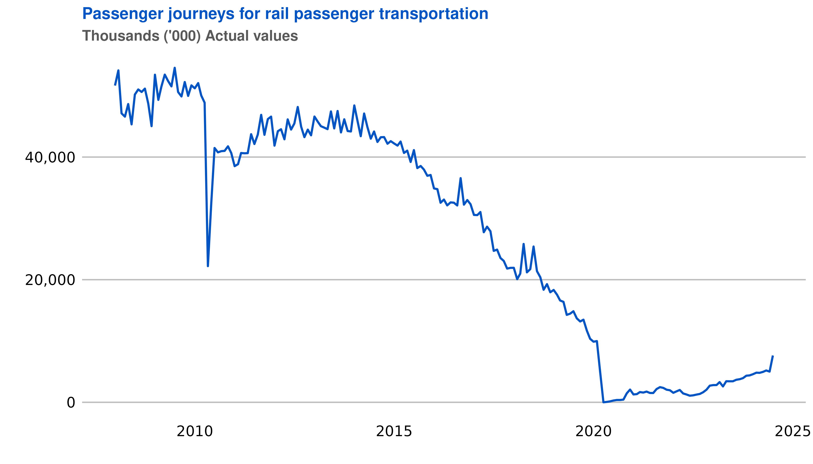

# berdata 

[](https://www.tidyverse.org/lifecycle/#experimental)
[](https://github.com/Bureau-for-Economic-Research/berdata/commits/develop)

The [berdata](https://github.com/Bureau-for-Economic-Research/berdata)
library is a *basic* wrapper around the [Data Playground
Portal](https://dataplayground.beranalytics.co.za/) API from BER
maintained by the [Bureau for Economic
Research](https://www.ber.ac.za/home/).

This is the homepage for the {berdata} R package
<https://github.com/Bureau-for-Economic-Research/berdata>.

**NOTE:** The API is currently in *BETA* testing.

## Disclaimer

This package was developed at the [Bureau for Economic
Research](https://www.ber.ac.za/home/) in order to streamline research
processes and allow automation for its internal research.

## About BER

The Bureau for Economic Research (BER) is one of the oldest economic
research institutes in South Africa. It was established in 1944 and is
part of the Faculty of Economic and Management Sciences (EMS) at
Stellenbosch University. Over the years, the BER has built a local and
international reputation for independent, objective and authoritative
economic research and forecasting.

## Installation

Install from GitHub.

``` r
remotes::install_github("Bureau-for-Economic-Research/berdata")
```

## Usage

``` r
library(berdata)
```

Check version.

``` r
packageVersion("berdata")
```

### Set API Key

To access the API you’ll need to first specify an API in your
`.Renviron` key as provided to you by [BER](https://www.ber.ac.za).
(`usethis::edit_r_environ()`)

- `.Renviron`

``` txt
BERDATA_API=place_your_key_here
```

After setting the API key in `.Renviron`, remember to restart R:
`ctrl + shift + F10`.

- In R

``` r
Sys.setenv(BERDATA_API = "place_your_key_here")
Sys.getenv("BERDATA_API")
```

# The API interface

The package provides an interface to the [BER](https://www.ber.ac.za)
data API. The function `get_data` has the following options:

- `time_series_code` time series code to return, `KBP7096B`
- `output_format` log file to output to

``` r
library(berdata)
library(logger)
library(tidyr)

get_data(time_series_code = "KBP7096B",
         output_format = "codes") %>% 
  drop_na()

# # A tibble: 776 × 2                                  
#    date_col   KBP7096B
#    <date>        <dbl>
#  1 1960-01-01      5.5
#  2 1960-02-01      4.6
#  3 1960-03-01      3.3
#  4 1960-04-01      2.5
#  5 1960-05-01      1.2
#  6 1960-06-01      0.4
#  7 1960-07-01      1.2
#  8 1960-08-01      2.5
#  9 1960-09-01      2.1
# 10 1960-10-01      2.5
# ℹ 766 more rows
# ℹ Use `print(n = ...)` to see more rows
```

If you want to turn on the logging:

``` r
library(berdata)
library(logger)
library(tidyr)

log_threshold(level = DEBUG)
get_data(time_series_code = c("KBP7096B","KBP7008Q", "KBP7203M"),
         output_format = "codes") %>% 
  drop_na()

# DEBUG [2024-10-17 16:15:37] Querying with parameters: [{"data":["KBP7096B","KBP7008Q","KBP7203M"],"interface":["api"],"platform":["R"]}]
# DEBUG [2024-10-17 16:15:38] Total runtime: [0.756s]                                                                                                                                                                            
# A tibble: 604 × 4
#    date_col   KBP7096B KBP7203M KBP7008Q
#    <date>        <dbl>    <dbl>    <dbl>
#  1 1974-05-01      1.2     76        6.3
#  2 1974-06-01      1       67        6.3
#  3 1974-07-01      0.5     58        4.7
#  4 1974-08-01      0.5     49        4.7
#  5 1974-09-01     -0.2     47.7      4.7
#  6 1974-10-01     -1.6     46.3      2.1
#  7 1974-11-01     -3.3     45        2.1
#  8 1974-12-01     -4.4     44        2.1
#  9 1975-01-01     -4.7     43       10  
# 10 1975-02-01     -5.2     42       10  
# ℹ 594 more rows
# ℹ Use `print(n = ...)` to see more rows
```

# Different Formats

## Codes

``` r
library(berdata)
library(tidyr)

get_data(time_series_code = c("KBP7096B","KBP7008Q", "KBP7203M"),
         output_format = "codes") %>% 
  drop_na()

# A tibble: 604 × 4
#    date_col   KBP7096B KBP7203M KBP7008Q
#    <date>        <dbl>    <dbl>    <dbl>
#  1 1974-05-01      1.2     76        6.3
#  2 1974-06-01      1       67        6.3
#  3 1974-07-01      0.5     58        4.7
#  4 1974-08-01      0.5     49        4.7
#  5 1974-09-01     -0.2     47.7      4.7
#  6 1974-10-01     -1.6     46.3      2.1
#  7 1974-11-01     -3.3     45        2.1
#  8 1974-12-01     -4.4     44        2.1
#  9 1975-01-01     -4.7     43       10  
# 10 1975-02-01     -5.2     42       10  
# ℹ 594 more rows
# ℹ Use `print(n = ...)` to see more rows
```

## Names

``` r
library(berdata)
library(tidyr)

get_data(time_series_code = c("KBP7096B","KBP7008Q", "KBP7203M"),
         output_format = "names") %>% 
  drop_na()

# A tibble: 604 × 4
#    date       `Constraints on current manufacturing activities: shortage of raw materials` `Total employment in the private sector` `Coincident indicator of the US`
#    <date>                                                                            <dbl>                                    <dbl>                            <dbl>
#  1 1974-05-01                                                                          1.2                                     76                                6.3
#  2 1974-06-01                                                                          1                                       67                                6.3
#  3 1974-07-01                                                                          0.5                                     58                                4.7
#  4 1974-08-01                                                                          0.5                                     49                                4.7
#  5 1974-09-01                                                                         -0.2                                     47.7                              4.7
#  6 1974-10-01                                                                         -1.6                                     46.3                              2.1
#  7 1974-11-01                                                                         -3.3                                     45                                2.1
#  8 1974-12-01                                                                         -4.4                                     44                                2.1
#  9 1975-01-01                                                                         -4.7                                     43                               10  
# 10 1975-02-01                                                                         -5.2                                     42                               10  
# ℹ 594 more rows
# ℹ Use `print(n = ...)` to see more rows
```

## Nested

``` r
library(berdata)

get_data(time_series_code = c("KBP7096B","KBP7008Q", "KBP7203M"),
         output_format = "nested")

# A tibble: 3 × 11
#   source country name              frequency frequency_description classification                     description                                                                     timeseries_code unit_of_measure unit_of_measure_description        data                
#   <chr>  <chr>   <chr>             <chr>     <chr>                 <chr>                              <chr>                                                                           <chr>           <chr>           <chr>                              <list>              
# 1 SARB   ZA      quaterly_bulletin quaterly  Monthly               Business cycle and labour analysis Coincident indicator of the US                                                  KBP7096B        PERC            12-Term % change                   <tibble [1,223 × 2]>
# 2 SARB   ZA      quaterly_bulletin monthly   Monthly               Business cycle and labour analysis BER: Constraints on current manufacturing activities: shortage of raw materials KBP7203M        NA              NA                                 <tibble [1,223 × 2]>
# 3 SARB   ZA      quaterly_bulletin quaterly  Quarterly             Business cycle and labour analysis Total employment in the private sector                                          KBP7008Q        PERC            Seasonally adjusted at annual rate <tibble [1,223 × 2]>
# ℹ 1,213 more rows
# ℹ Use `print(n = ...)` to see more rows
```

# Plotting series

``` r
library(tidyverse)
library(bertheme)
library(berdata)

get_data(time_series_code = c("P7162-N-VALSEAS-RAILPJOUR"),
         output_format = "codes") %>% 
  ggplot(., aes(x = date_col, y = `P7162-N-VALSEAS-RAILPJOUR`, color = "P7162")) +
  geom_line(linewidth = 1.25) +
  scale_y_continuous(labels = scales::comma) +
  scale_color_ber() +
  labs(
    title = "Passenger journeys for rail passenger transportation",
    subtitle = "Thousands ('000) Actual values",
    y = "",
    x = ""
  ) + 
  theme_ber(base_size = 18, title_size = 20,
                          subtitle_size = 18,
                          subtitle_color = "#595959") +
  guides(color ="none")

ggsave(filename = "man/figures/series.png", 
       width = 14, 
       height = 8)
```



``` r
library(tidyverse)
library(bertheme)
library(berdata)

get_data(time_series_code = c("P4141-ELEKTR23", "P4141-ELEKTR24"),
         output_format = "nested") %>% 
  select(description, data) %>% 
  unnest %>% 
  filter(date_col > "2015-01-01") %>% 
  ggplot(., aes(x = date_col, y = value, color = description)) +
  geom_line(linewidth = 1.25) +
  scale_y_continuous(labels = scales::comma) +
  scale_color_ber() +
  labs(
    title = "Electricity generated and available for distribution",
    subtitle = "Gigawatt-Hours",
    y = "",
    x = ""
  ) + 
  theme_ber(base_size = 18, title_size = 20,
                          subtitle_size = 18,
                          subtitle_color = "#595959") +
  guides(color = guide_legend(nrow = 2,
                              byrow = TRUE))

ggsave(filename = "man/figures/series_02.png", 
       width = 14, 
       height = 8)
```


